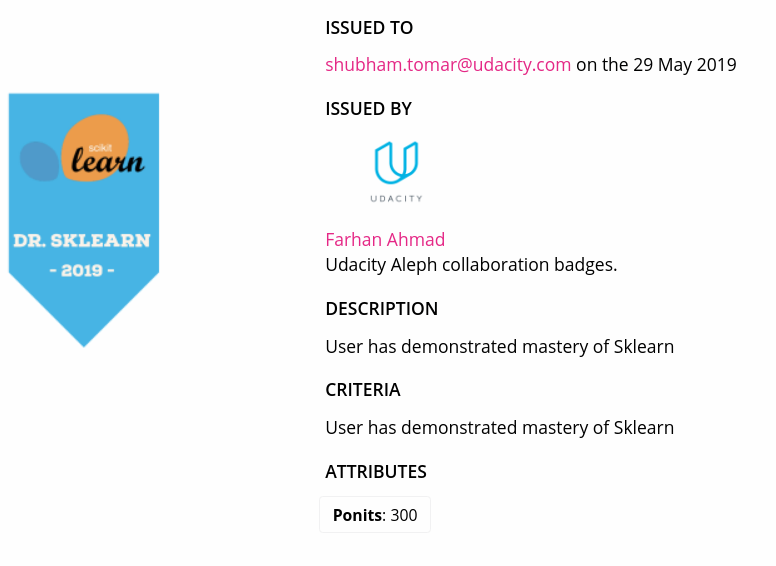

# Udacity Aleph [Work In Progress 🚧]
Collaborative projects from the real world.

### What is Udacity Aleph?
Udacity Aleph is an initiative that lets you, our students, transfer key skills learned from a nanodegree in the real-world. As part of the initiative we will roll out challenges every month. The challenges will require students to work on a real-world problem along with **collaborators**. Students who participate in the challnges will pick up 

## About Aleph

1. Need for extra projects
- Why collaboration?
- Logistics
  - Cadence
  - Platforms
  - Problem Pipeline
  - Duration
  - Publicity 
  - Metrics
  - Evaluation

